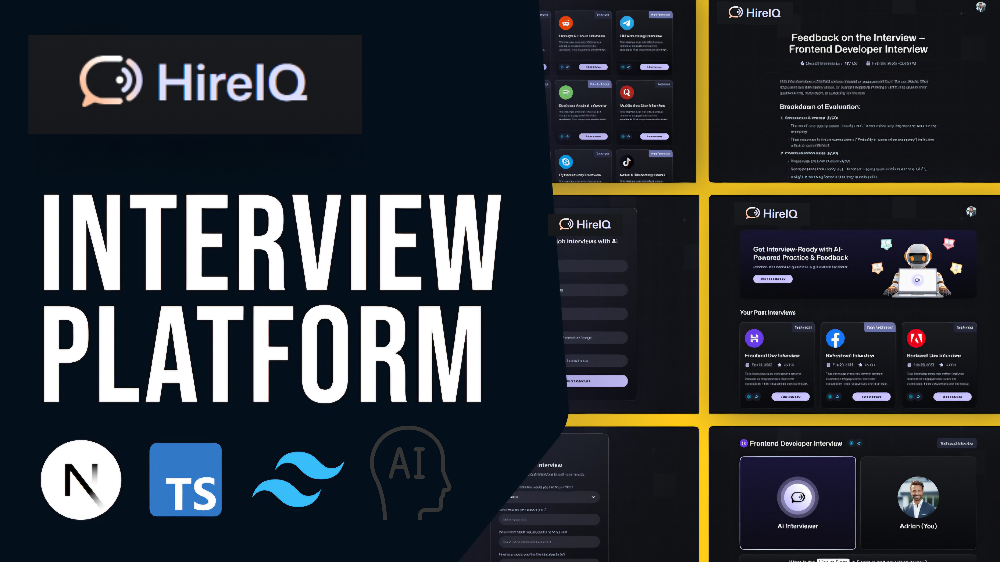
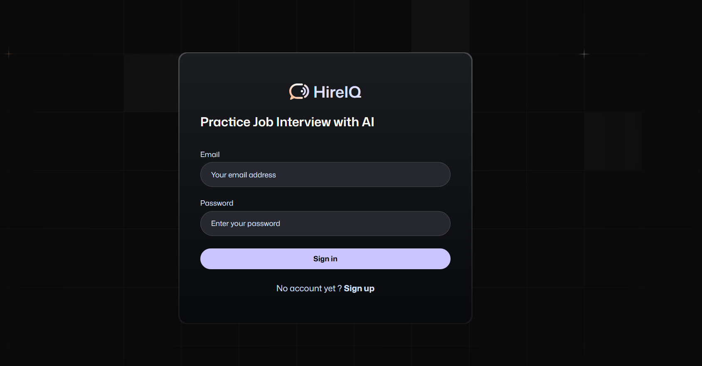
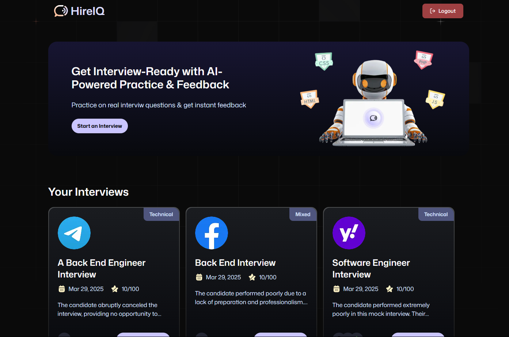
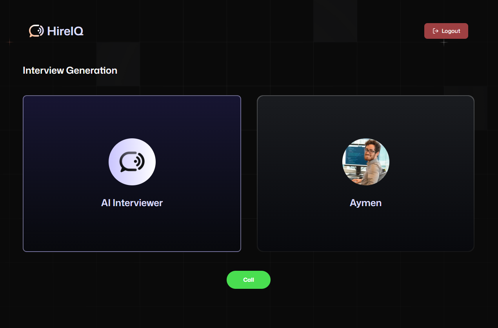
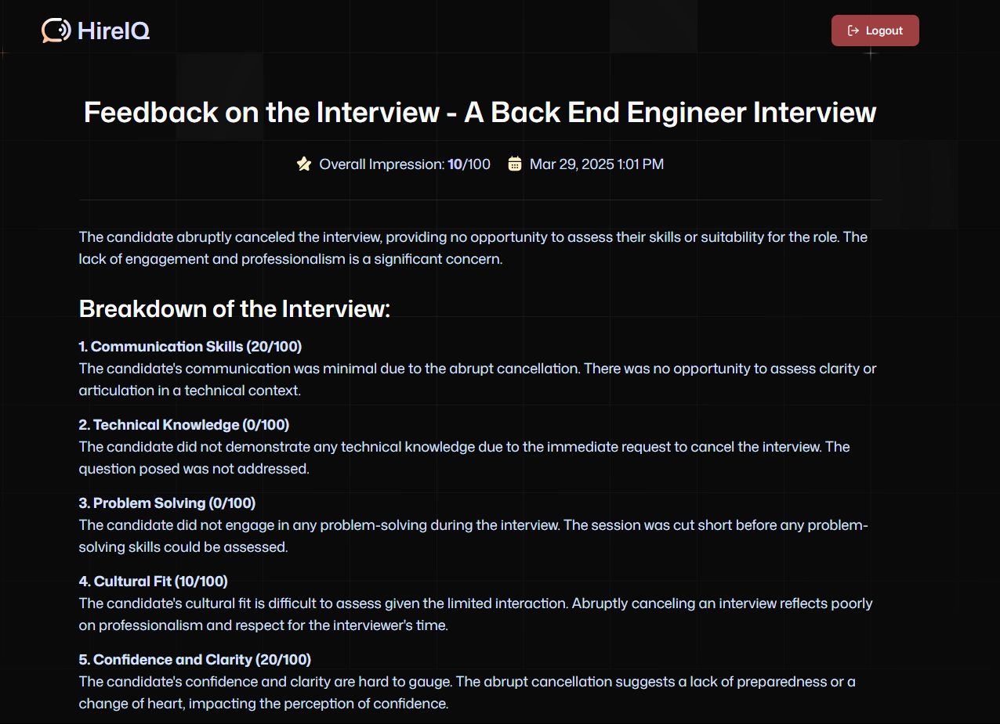

<div align="center">
  <br />
    <a href="" target="_blank">
      
    </a>
  <br />

  <div>
    
    
    
    
    
    
    

  </div>

  <h3 align="center">🚀 AI-Powered Job Interview Preparation</h3>
</div>

## 🤖 Introduction

HireIQ is an **AI-driven platform** designed to help users prepare for job interviews through **interactive voice-based simulations**. Built with **Next.js** for a seamless user experience, **Firebase** for authentication and data storage, and **Vapi's voice agents** for realistic AI-powered conversations, HireIQ delivers an innovative way to refine interview skills.

---

## 🔥 Features

✅ **AI-Powered Voice Interviews** – Simulate real interviews using AI-driven voice agents powered by Vapi.  
✅ **Personalized Feedback** – Get AI-generated insights to improve your responses.  
✅ **Secure Authentication** – Firebase ensures seamless user authentication and secure data storage.  
✅ **Modern UI/UX** – Designed with TailwindCSS for a sleek and responsive experience.  
✅ **Scalable & Performant** – Built with Next.js for fast performance and easy scalability.  
✅ **Progress Tracking** – Monitor improvement over time with interactive analytics.  
✅ **Multi-Role Support** – Prepare for a wide variety of job roles with tailored questions.  
✅ **Real-Time Insights** – Instant analysis and suggestions to enhance responses.

## 🚀 Live Demo

**Here is a working live demo : https://mock-interview-platform-zeta.vercel.app/**

---

## 📸 Screenshots

<p align="center">
  
</p>
<p align="center">
  
</p>
<p align="center">
  
</p>
<p align="center">
  
</p>

---

## 🛠️ Tech Stack

- **Frontend & Backend:** Next.js
- **Authentication & Database:** Firebase
- **Styling:** TailwindCSS
- **AI Voice Agents:** Vapi
- **Icons:** Lucide React
- **Deployment:** Vercel
- **State Management:** React Context API

---

## ⚡ Installation & Setup

### 1️⃣ Clone the Repository

```sh
git clone https://github.com/AymenGabsi/mock_interview_platform.git
cd mock_interview_platform
```

### 2️⃣ Install Dependencies

```sh
npm install  # or yarn install
```

### 3️⃣ Set Up Environment Variables

Create a `.env.local` file and add your Firebase and Vapi API keys:

```
FIREBASE_PROJECT_ID=your_firebase_id
FIREBASE_PRIVATE_KEY=your_firebase_key
FIREBASE_CLIENT_EMAIL=your_client_mail
GOOGLE_GENERATIVE_AI_API_KEY=gemini_api_key
NEXT_PUBLIC_VAPI_WEB_TOKEN=vapi_web_token
NEXT_PUBLIC_VAPI_WORKFLOW_ID=vapi_workflow_id
```

### 4️⃣ Start the Development Server

```sh
npm run dev  # or yarn dev
```

The app will be available at **http://localhost:3009** 🚀

---

## 📜 Usage

1. **Sign up or log in** using Firebase authentication.
2. **Choose a job role** and start a simulated AI-powered interview.
3. **Receive instant feedback** and improve your responses.
4. **Track your progress** and refine your interview skills.
5. **Repeat interviews** with different scenarios to improve adaptability.

---

## 🚀 Deployment

### Deploy to Vercel

```sh
npm run build
vercel deploy
```

### Configure Environment Variables on Vercel

1. Go to your **Vercel dashboard**.
2. Navigate to your project settings.
3. Under the **Environment Variables** section, add all variables from your `.env.local` file.
4. Deploy your project!

---

## 👥 Contributing

We welcome contributions! To contribute:

1. **Fork the repo.**
2. **Create a new branch:** `git checkout -b feature-name`.
3. **Make your changes** and commit: `git commit -m 'Added new feature'`.
4. **Push to the branch:** `git push origin feature-name`.
5. **Open a Pull Request** and describe your changes.

### Contribution Guidelines

- Follow the existing coding style.
- Write clear, concise commit messages.
- Ensure new features are properly documented.
- Test changes thoroughly before submitting a PR.

---

## 📝 License

This project is licensed under the **MIT License**.

---

## 📧 Contact

For questions, feedback, or collaborations:

- **Email:** aymengabsi.se@gmail.com
- **GitHub Issues:** [Open an issue](https://github.com/AymenGabsi/mock_interview_platform/issues)
- **Community Chat:** Join our [Discord server](https://discord.gg/your-server-link)
